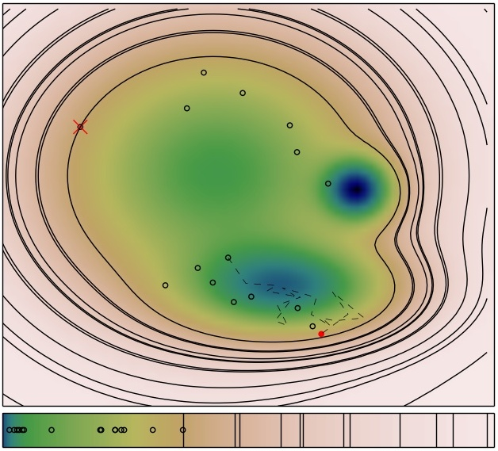

Nested Sampling
---------------

Source code: https://github.com/js850/nested_sampling

Documentation: http://js850.github.io/nested_sampling

Flexible and efficient Python implementation of the nested sampling algorithm.
This implementation is geared towards allowing statistical physicists to use this
method for thermodynamic analysis but is also being used by astrophysicists.

This implementation uses the language of statistical mechanics (partition function, 
phase space, configurations, energy, density of states) rather than the language 
of Bayesian sampling (likelihood, prior, evidence). This is simply for convenience, 
the method is the same.

The package goes beyond the bare implementation of the method providing:

* built-in parallelisation on single computing node (max total number of cpu threads on a single machine)

* built-in Pyro4-based parallelisation by distributed computing, ideal to run calculations on a cluster or across a network

*  ability to save and restart from checkpoint binary files, ideal for very long calculations

* scripts to compute heat capacities and perform error analysis

* integration with the `MCpele  <https://pele-python.github.io/mcpele/>`_ package to implement efficient Monte Carlo walkers.

  
  Figure 1: Snapshot of a Nested Sampling iteration on a multimodal surface. Each contour
  line corresponds to a past maximum energy (log-likelihood) constraint. The inner most
  contour line corresponds to the current constraint and the corresponding sample is removed
  (crossed in red) and replaced by walking a copy of a randomly selected replica (walk trajectory
  is the dashed line and the red point is the new configuration that satisfies the tighter constraint).
  The bottom panel shows the fraction of phase space corresponding to each sample and the
  iterative contractions (corresponding to the contours) are shown by the horizontal lines.
  Note that the nested sampling contraction of phase space is constant in the log of phase space
  volume. The full animation can be run from the example folder.

nested sampling has been authored by Stefano Martiniani Jacob D. Stevenson at the University of Cambridge.
The project is publicly available under the GNU general public licence.

INSTALLATION
============

Required packages
-----------------

for compilation:

1. c/c++ compiler

python packages:

1. numpy: 
     We use numpy everywhere for doing numerical work.

#. matplotlib:
     For making plots

#. cython:
     For interfacing c/c++ to Python 

#. Pyro4: optional 
     for distributed parallelisation

All the above packages can be installed via the python package manager pip (or
easy_install), with the exception of pele.  However, some of the packages (numpy, scipy) 
have additional dependencies and it can be more convenient to use the linux package manager
(apt, yum, ...).

Installing prerequisites on Ubuntu
----------------------------------
If you're running ubuntu, you can get all the prerequisites with the following
commands::

  $ sudo apt-get install python-numpy python-matplotlib python-pip cython
  $ pip install --user pyro4

Compilation
-----------

Compilation is required for the heap capacity routines and possibly for Monte Carlo walkers
if these make use of more efficient c++ routines This package uses the standard python setup 
utility (distutils).  There are lots of options for how and where to install. 
For more information::
  
  $ python setup.py --help 
  $ python setup.py --help-commands

Developers probably want to install "in-place", i.e. build the extension
modules in their current directories::

  $ python setup.py build_ext -i

Users can install pele in the standard python package location::

  $ python setup.py build
  $ python setup.py install [--user]

where --user installs it in $HOME/.local/

PYTHONPATH  
----------
If you do an in-place install, make sure to add the install directory to your
PYTHONPATH environment variable.  This is not necessary if you install to a
standard location.

Running
=======

You can find examples of how to run nested sampling in the examples folder.  More
information can be found in the documentation at

 http://js850.github.io/nested_sampling

Tests
=====
Nested sampling has a suite of unit tests. They can be run using the nose testing
framework (which can be installed using pip). The tests are run from the top
directory with this command::

  nosetests nested_sampling
